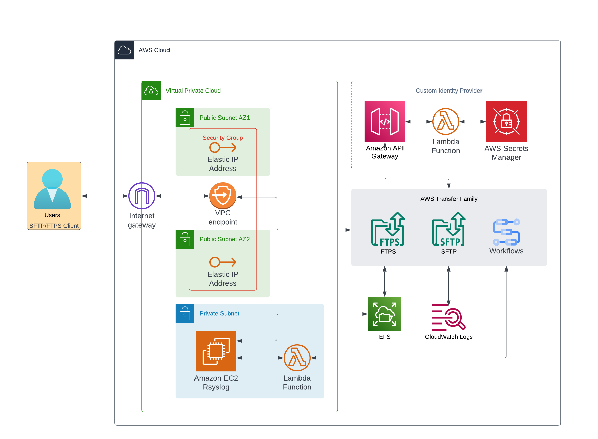

# AWS Transfer Family OpenText PoC

## Introduction
The purpose of this repository is to present the capabilities that AWS Transfer Family can provide to OpenText and the possibility to replace their existing FTP Servers, NFS Mounts and User Management. Please refer to the Lucid Charts diagram below


Providing an overview of the feature of the transfer family

- show how SFTP and FTPS transfers can be done with AWS Transfer Family with EFS Backend storage
- show workflows capabilities and how to write to rsyslogs when uploading files to preserve their existing automation.
- show how to manage users with custom identity provider
- show logging options with Cloudwatch logs.


## Prerequisites 
Terraform version ~> 1.3.9
The  .terraform-version or version.tf works with tfenv . It will install if needed and switch to the Terraform version specified.

awscli version `aws-cli/2.11.2`

## version.tf 
```
terraform {
  required_version = "~> 1.3.9"
}
```

## aws-version
```
aws = {
      source  = "hashicorp/aws"
      version = "~> 4.59.0"
    }
```


## Environment Variables

Environment variables needed to execute this deployment.

| Name | Value | Description |
|------|---------|--------|
|AWS_ACCESS_KEY_ID| n/a | n/a |
|AWS_SECRET_ACCESS_KEY| n/a | n/a |
|AWS_REGION | us-east-1| n/a |
|ENV | poc | n/a |


## Architecture implemented

